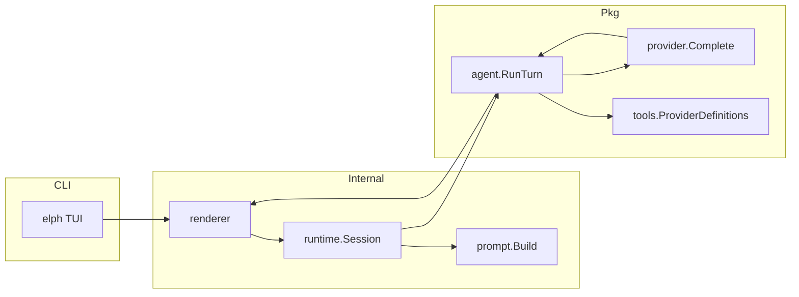

# Architecture

High-level map of the Elph codebase. Module: `github.com/riipandi/elph` (Go 1.26). Binary: `elph` from `cmd/elph`.

## Repository layout

```
elph/
├── cmd/elph/          CLI entry (Cobra): TUI, provider management, version
├── internal/          Application-private packages (not importable externally)
│   ├── appdir/        XDG-compliant paths (config, data)
│   ├── datastore/     SQLite DB init, migrations, global singleton
│   └── ...
├── pkg/               Reusable libraries (agent, tools, AI providers)
├── docs/              Documentation
├── schemas/           JSON schemas for provider/MCP/config formats
└── Makefile           build, test, lint, install

## `cmd/elph`

| File / area             | Role                                                   |
|-------------------------|--------------------------------------------------------|
| `main.go`, `root.go`    | Default: launch TUI; global `--env-file`               |
| `provider.go`           | `elph provider connect|update|list`                    |
| `provider_enable.go`    | `elph provider enable|disable`, `model enable|disable` |
| `provider_progress*.go` | Terminal progress UI for connect/update                |
| `doctor.go`             | Stub — not implemented                                 |
| `version`               | Build metadata from `internal/config`                  |

## `internal/` packages

| Package           | Responsibility                                                                                                              |
|-------------------|-----------------------------------------------------------------------------------------------------------------------------|
| `align`           | Column alignment for command palettes                                                                                       |
| `command`         | Slash commands, fuzzy suggest, `/model` handler                                                                             |
| `config`          | Build-time version/hash/date (Makefile ldflags)                                                                             |
| `constants`       | Agent modes, thinking levels, colors, keybindings, tips                                                                     |
| `datastore`       | SQLite DB via Turso (`turso.tech/database/tursogo`), migration runner, global singleton                                     |
| `git`             | Git footer: lightweight `ReadBranch` (`.git/HEAD`) + full `Read` (go-git line stats on demand)                              |
| `mention`         | `@` file/path autocomplete in input                                                                                         |
| `prompt`          | System prompt assembly (`AGENTS.md`, skills, session state, response language, tools)                                       |
| `prompt/template` | Load `*.md` templates with frontmatter and `$1` args                                                                        |
| `renderer`        | Bubble Tea v2 TUI (viewport, input, paste collapse/editor, agent bridge, prose/Glamour markdown, AI copy hint, huh dialogs) |
| `projectdir`      | Project-local paths (`<workDir>/.agents/elph`, `.gitignore`)                                                                |
| `runtime`         | Session, tool execution (including goal.go), shell, JSONL session logs (`slog`)                                             |
| `settings`        | Layered `settings.json` (`~/.elph` + project `.agents/elph`), `version.json` sync metadata                                  |
| `theme`           | `auto` / `dark` / `light` lipgloss themes                                                                                   |
| `tools`           | Diagnostic helpers (not agent-executable)                                                                                   |

## `pkg/` packages

| Package            | Responsibility                                                                                                                                                                                                                                        |
|--------------------|-------------------------------------------------------------------------------------------------------------------------------------------------------------------------------------------------------------------------------------------------------|
| `ai`               | Facade: `LoadProviders`, `ResolveProvider`                                                                                                                                                                                                            |
| `ai/protocol`      | Shared provider contract: `TurnRequest`, `Provider`, `Compat`, errors                                                                                                                                                                                 |
| `ai/provider`      | Provider catalog (`~/.elph/providers`), resolve/select, thinking templates, models.dev sync                                                                                                                                                           |
| `ai/providers`     | Reusable SDK adapters: `openai`, `openaicompat`, `openrouter`, `anthropic`, `google` ([openai-go](https://github.com/openai/openai-go), [anthropic-sdk-go](https://github.com/anthropics/anthropic-sdk-go), [genai](https://google.golang.org/genai)) |
| `ai/providertests` | Cross-provider httptest suites (fantasy-style)                                                                                                                                                                                                        |
| `ai/utils`         | Resty v3 HTTP helpers, SSE streaming, retry, stall detection                                                                                                                                                                                          |
| `core/agent`       | Turn loop, events, text-markup tool parser, native tool loop, history/tool truncation limits                                                                                                                                                          |
| `core/fuzzy`       | Subsequence fuzzy matching                                                                                                                                                                                                                            |
| `tool`             | Built-in tool catalog, provider schemas, `IsProviderExposed`                                                                                                                                                                                          |
| `tools/goal`       | Goal types, snapshot, context-scoped manager for CreateGoal/GetGoal/UpdateGoal/SetGoalBudget                                                                                                                                                          |

## Runtime data flow



1. User submits input in `internal/renderer`.
2. Slash commands → `internal/command`; shell `!`/`!!` → `runtime.RunShell`; else → `Session.StartTurn`.
3. Session builds system prompt, attaches history, enables `ExecuteTool`.
4. `agent.RunTurn` runs single-shot or multi-round native tool loop.
5. Provider HTTP adapters stream deltas; events update the TUI.

See [agent-runtime.md](./agent-runtime.md) for the full turn pipeline.

## Performance and memory

Elph targets a low idle footprint (~30 MB RSS on a typical macOS session) by deferring heavy work and capping retained data.

| Area             | Strategy                                                                                                                                                                   | Code                                                                  |
|------------------|----------------------------------------------------------------------------------------------------------------------------------------------------------------------------|-----------------------------------------------------------------------|
| Startup          | No synchronous go-git open; branch placeholder `—` until first async refresh                                                                                               | `renderer.New`, `footer.go`                                           |
| Git (idle)       | `ReadBranch` every 2 min — reads `.git/HEAD` only; `+N -N` stats unchanged                                                                                                 | `internal/git/branch.go`, `gitRefreshTick`                            |
| Git (full)       | `git.Read` (go-git + line diffs, max 32 paths) on footer git click or after shell                                                                                          | `internal/git/status.go`, `footer.go`, `shell.go`                     |
| Provider catalog | Session keeps trimmed catalog; inactive models use `SlimModel`                                                                                                             | `pkg/ai/provider/catalog_trim.go`                                     |
| Conversation     | `CompactMessages` + per-field caps before history/API/TUI                                                                                                                  | `pkg/core/agent/limits.go`, `truncate.go`                             |
| Tool output      | Read/Write/Edit/Grep/Glob caps at execution time                                                                                                                           | `internal/runtime/execute.go`                                         |
| Prompt templates | Loaded on first `/` command, not at TUI init                                                                                                                               | `renderer/model.go`                                                   |
| Tool-call regex  | Compiled once via `sync.Once`                                                                                                                                              | `pkg/core/agent/toolcall_regex.go`                                    |
| Markdown         | Plain while streaming; Glamour v2 after complete (async + preprocess); per-line paint for tables/quotes; copy hint on finished AI messages; Glamour cache cleared per turn | `renderer/markdown.go`, `glamour_styles.go`, `ai_copy.go`, `agent.go` |
| models.dev       | One startup preview; huh confirm before full sync                                                                                                                          | `renderer/models_sync.go`                                             |

Turn-time limits and sizes are listed in [agent-runtime.md § In-memory history](./agent-runtime.md#in-memory-history).

## Configuration surfaces

| Surface                                             | Doc                                                                                                     |
|-----------------------------------------------------|---------------------------------------------------------------------------------------------------------|
| `~/.elph/settings.json`, `version.json`             | [configuration.md](./configuration.md), [schemas/config-schema.json](../schemas/config-schema.json)     |
| `~/.elph/providers/*.json`                          | [configuration.md](./configuration.md), [schemas/provider-schema.json](../schemas/provider-schema.json) |
| `~/.elph/prompts/`, project `.agents/elph/prompts/` | [prompt-templates.md](./prompt-templates.md)                                                            |
| Env vars (`ELPH_*`, API keys)                       | [configuration.md](./configuration.md)                                                                  |

## External tools (planned)

Built-ins (`pkg/tools`) are the core. Two **combined** extension mechanisms — different purpose, shared host pipeline:

| Mechanism                     | Library                       | Role                                                                                                 |
|-------------------------------|-------------------------------|------------------------------------------------------------------------------------------------------|
| **MCP**                       | `modelcontextprotocol/go-sdk` | Ecosystem tool servers (stdio/SSE); config `schemas/mcp-schema.json`                                 |
| **Go plugins**                | `hashicorp/go-plugin`         | Local compiled binaries under `~/.elph/plugins/`; gRPC subprocess                                    |
| **WASM plugins** (alt, later) | `tetratelabs/wazero`          | Sandboxed `.wasm` modules — optional third local backend; see [consideration.md](./consideration.md) |

Runtime will merge definitions from all sources, apply the same exposure/approval rules ([tools.md](./tools.md)), and dispatch in `internal/runtime.ExecuteTool` by prefix (`mcp_*`, `plugin_*`, built-in names). System prompt uses `prompt.ExternalEntry` for non-built-in tools.

- MCP JSON schema exists — **not loaded by runtime yet**
- TUI banner: `MCP Server: 0/0 connected (0 tools)` — placeholder until MCP client lands

See [consideration.md § Extension model](./consideration.md#extension-model-mcp--go-plugins-combined).

## Diagnostic vs agent tools

| Namespace            | Package          | Callable by model?                        |
|----------------------|------------------|-------------------------------------------|
| Built-in agent tools | `pkg/tools`      | Yes (when API-exposed + executable)       |
| Diagnostic helpers   | `internal/tools` | No — use slash commands (`/diagnostic:*`) |

## Related docs

- [agent-runtime.md](./agent-runtime.md) — sessions, logging, tool loop
- [tools.md](./tools.md) — tool catalog and API filter
- [cli.md](./cli.md) — non-TUI commands
- [progress.md](./progress.md) — recent feature development log
