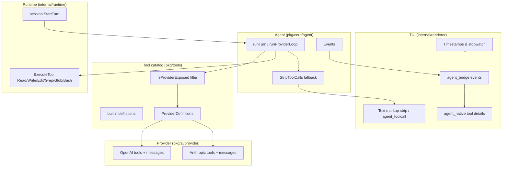

# Development Progress — Agent Tools & Provider Integration

This document records work done to improve Elph's agent tool handling, provider
integration, and TUI feedback. It is a living log for contributors tracking what
shipped, where the code lives, and what remains.

**Last updated:** June 2026

> **Documentation index:** [docs/README.md](./README.md) — architecture, configuration, CLI, slash commands, agent runtime, and a gap audit vs the codebase.

---

## Context

Early sessions surfaced several related problems:

1. Models sometimes wrote **XML-style tool markup** in plain assistant text
   (`<toolcall>`, `<function=WebSearch>`, `<parameter>`) instead of using the
   provider's native tool-calling API.
2. **Raw markup and tool queries** leaked into the AI message bubble (e.g. a
   WebSearch query appearing as the assistant reply).
3. The model could be offered **tools the runtime could not execute**, leading
   to confusing `tool unavailable` outcomes.
4. The TUI needed clearer **timing and status** feedback during agent activity
   and tool runs.

The work below addresses these in layers: TUI polish, text-markup mitigation,
native provider tool calling, API-side tool filtering, and clearer error
presentation.

---

## 1. TUI timing and message metadata

### User message timestamps

User and assistant message blocks can show a compact local timestamp.

| Item                 | Location                                              |
|----------------------|-------------------------------------------------------|
| Timestamp formatting | `internal/renderer/message_time.go`                   |
| Render integration   | `internal/renderer/collapsible_message.go`, `view.go` |
| Tests                | `internal/renderer/message_time_test.go`              |

Format: `15:04:05` for today; `Jan 2 15:04:05` for other days.

### Activity stopwatch

A stopwatch tracks elapsed time during agent activity phases (thinking,
connecting, tool work).

| Item                         | Location                                              |
|------------------------------|-------------------------------------------------------|
| Stopwatch model & formatting | `internal/renderer/activity_stopwatch.go`             |
| Agent state                  | `internal/renderer/state.go` (`AgentState.Stopwatch`) |
| Tests                        | `internal/renderer/activity_stopwatch_test.go`        |

Provider bootstrap/update flows also use a stopwatch in
`cmd/elph/provider_progress.go`.

---

## 2. Tool failure and unavailable-tool UX

### Runtime error types

| Error                   | Meaning                                        |
|-------------------------|------------------------------------------------|
| `ErrToolUnknown`        | Name not in the built-in catalog               |
| `ErrToolUnavailable`    | Known tool, but not executable in this session |
| `ErrToolNotImplemented` | Executable path exists but handler missing     |

Defined in `internal/runtime/tool.go` and `internal/runtime/execute.go`.

### Detail box status

Collapsible tool detail blocks use status-driven colors and preview labels:

| Status                    | When                            |
|---------------------------|---------------------------------|
| `DetailStatusRunning`     | Tool in progress                |
| `DetailStatusSuccess`     | Completed without error         |
| `DetailStatusError`       | Unknown tool or execution error |
| `DetailStatusUnavailable` | Known but not executable        |
| `DetailStatusWarning`     | Cancelled                       |

Implemented in `internal/constants/detail_status.go` and
`internal/renderer/detail_status.go`.

### User-facing messages

`ResolveToolRequest` in `internal/runtime/tool.go` classifies text-markup tool
requests and returns structured copy for the detail box, including hints for
diagnostic helpers (e.g. use `/diagnostic:list-tools` instead of invoking
`ListTools` as an agent tool).

`FormatToolDetailBody` surfaces `Tool failed` with the error and any partial
output for native tool results.

Tests: `internal/renderer/tool_detail_test.go`.

---

## 3. Text markup tool-call mitigation (fallback path)

When the model emits tool-like XML in assistant text, a parser strips markup,
extracts invocations, and prevents duplicate payloads from appearing in the
visible reply.

### Parser pipeline

`StripToolCalls` in `pkg/core/agent/toolcall.go` runs a multi-stage pipeline:

1. **Smart strip first** — malformed segments without well-formed blocks
   (`pkg/core/agent/toolcall_smart.go`)
2. **Well-formed blocks** — `<toolcall>`, `<function=name>`, `<parameter=name>`
3. **Loose / orphan markup** — unclosed tags, orphan closers, name fragments
   (e.g. `=WebSearch>`)
4. **Unnamed parameters** — `<parameter>value</parameter>`
5. **Payload deduplication** — `StripExtractedPayloads` removes text that
   duplicates parsed parameter values (e.g. raw search queries)

### Renderer integration

The renderer applies stripping during streaming and on turn completion:

| File                                         | Role                           |
|----------------------------------------------|--------------------------------|
| `internal/renderer/agent.go`                 | Turn-end sanitization          |
| `internal/renderer/agent_toolcall.go`        | Stream-time tool-call handling |
| `internal/renderer/markdown.go`, `stream.go` | Markdown/stream sanitization   |

### Tests

| Package             | Files                                          |
|---------------------|------------------------------------------------|
| `pkg/core/agent`    | `toolcall_test.go`, `toolcall_payload_test.go` |
| `internal/renderer` | `agent_toolcall_test.go`                       |

### System prompt guardrail

`internal/prompt/builder.go` instructs the model to use **provider-native
tools** and not invent XML-like tool tags in assistant text.

---

## 4. Native provider tool calling

The long-term fix: use each provider's native tool-calling API so the model
receives JSON schemas and returns structured `tool_calls` / `tool_use` blocks.

### Provider layer

| Component                                   | Location                                             |
|---------------------------------------------|------------------------------------------------------|
| `ToolDefinition`, `ToolCall`, `ChatMessage` | `pkg/ai/provider/message.go`                         |
| `StopReason` (`end_turn`, `tool_use`, …)    | `pkg/ai/provider/message.go`                         |
| OpenAI tools & messages                     | `pkg/ai/provider/openai_tools.go`, `openai.go`       |
| Anthropic tools & messages                  | `pkg/ai/provider/anthropic_tools.go`, `anthropic.go` |
| Shared helpers                              | `pkg/ai/provider/tools.go`                           |
| Turn result fields                          | `pkg/ai/provider/result.go`                          |

### Agent loop

| Component                                | Location                                                                                                                      |
|------------------------------------------|-------------------------------------------------------------------------------------------------------------------------------|
| Multi-round tool loop (max 8 iterations) | `pkg/core/agent/loop.go`                                                                                                      |
| Tool execution hook                      | `pkg/core/agent/toolrun.go`                                                                                                   |
| Turn routing (native vs placeholder)     | `pkg/core/agent/turn.go`                                                                                                      |
| Events                                   | `pkg/core/agent/event.go` — `EventToolCallStart`, `EventToolCallOutputDelta`, `EventToolCallDone`, `TurnDoneWithHistoryEvent` |
| Options                                  | `pkg/core/agent/options.go` — `ToolsEnabled`, `ExecuteTool`, `ExecuteToolStream`, `InteractTool`, `SkipToolApproval`          |
| User interact                            | `pkg/core/agent/interact.go` — AskUser + approval kinds; denied message constant                                              |
| Tests                                    | `pkg/core/agent/loop_test.go`                                                                                                 |

Flow per iteration:

1. `Provider.Complete` with `TurnRequest.Tools` and conversation `Messages`
2. If `result.ToolCalls` non-empty → emit start/done events, run `ExecuteTool`
3. Append assistant message (with tool calls) and tool-result messages
4. Repeat until no tool calls or iteration limit

### Session wiring

`internal/runtime/session.go`:

- Enables `ToolsEnabled` when a provider is configured
- Injects `ExecuteTool` → `internal/runtime/execute.go`
- Persists `History` (`[]provider.ChatMessage`) across turns via
  `ApplyHistory` / `TurnDoneWithHistoryEvent`

### Runtime execution

`internal/runtime/execute.go` implements:

| Tool              | Behavior                                                   |
|-------------------|------------------------------------------------------------|
| **Read**          | Read file under workspace (256 KB cap)                     |
| **Write**         | Create parent dirs and write file contents                 |
| **Edit**          | Exact string replace; `replace_all` for multi-match        |
| **Grep**          | `rg` subprocess (`content`, `files_with_matches`, `count`) |
| **Glob**          | `doublestar.FilepathGlob` (`**` semantics, files only)     |
| **Bash**          | `bash -c`, streamed output, 120s timeout                   |
| **ReadMediaFile** | Image decode/resize → PNG + base64 metadata (32 KB cap)    |

`pkg/tools/exposure/exposure.go` — `IsExecutable` returns true for Read, Write, Edit,
Grep, Glob, ReadMediaFile, Bash, AskUser, TodoList, and Skill (AskUser returns the huh answer
without subprocess execution).

Tests: `internal/runtime/tool_test.go`, `internal/runtime/execute_file_test.go`.

### TUI — native tool rendering

| File                                 | Role                                                         |
|--------------------------------------|--------------------------------------------------------------|
| `internal/renderer/agent_native.go`  | Native tool detail boxes; Bash `$ cmd`; TodoList panel hooks |
| `internal/renderer/todo_panel.go`    | Tasks panel above input; hides on all-done + chat notice     |
| `internal/renderer/tool_interact.go` | huh AskUser / approval; truncated long descriptions          |
| `internal/renderer/agent_bridge.go`  | Maps agent events to TUI updates (incl. output deltas)       |
| `internal/runtime/shell.go`          | `ApplyStreamChunk`; `cmd.Cancel` for parallel test safety    |
| `internal/runtime/todos_log.go`      | Per-session `metadata/<sess_id>/todos.jsonl` snapshots       |

Native tool messages are tracked by `NativeToolMsgIDs` in `AgentState`
(`internal/renderer/state.go`).

---

## 5. Provider API tool filtering

**Problem:** `ProviderDefinitions()` initially exposed every `auto-allow` tool
with a schema (WebSearch, FetchURL, …) even though only Read/Grep/Glob could
run. Models called unavailable tools and got errors.

**Solution:** Expose tools to the API only when all of the following hold
(`IsProviderExposed`):

1. Known built-in
2. `DefaultApproval` is `auto-allow` or `requires-approval` (runtime gates the
   latter via huh)
3. `IsExecutable(name)`
4. Has a provider JSON schema

| Function              | Location                         | Role                             |
|-----------------------|----------------------------------|----------------------------------|
| `IsProviderExposed`   | `pkg/tools/exposure/exposure.go` | Single-tool gate                 |
| `FilterProviderTools` | `pkg/tools/schema/schema.go`     | Filter any tool list             |
| `ProviderDefinitions` | `pkg/tools/schema/schema.go`     | Built-in schemas → filtered      |
| Loop integration      | `pkg/core/agent/loop.go`         | Always filters before `Complete` |

**Currently API-exposed:** Read, Write, Edit, Grep, Glob, ReadMediaFile, AskUser, Bash, TodoList, Skill.

Detailed reference: [docs/tools.md § Provider API exposure](./tools.md#provider-api-exposure).

Tests: `pkg/tools/schema/schema_test.go`, `pkg/tools/exposure/exposure_test.go`.

---

## 6. Architecture overview



---

## 7. File index (new or materially changed)

### `pkg/core/agent`

- `loop.go`, `loop_test.go` — native tool loop
- `toolcall.go`, `toolcall_smart.go`, `toolcall_payload.go` — text markup parser
- `toolrun.go` — tool result formatting
- `event.go`, `options.go`, `turn.go` — events and turn routing

### `pkg/tools`

- `schema/schema.go` — provider schemas and API filter
- `exposure/exposure.go` — `IsExecutable`, `IsProviderExposed`
- `todolist/` — TodoList tool state and argument handling

### `pkg/ai/provider`

- `message.go`, `tools.go`, `result.go` — shared types
- `openai_tools.go`, `anthropic_tools.go` — provider adapters
- `openai.go`, `anthropic.go` — request building with tools

### `internal/runtime`

- `session.go` — history, tools enabled, execute hook
- `execute.go`, `tool.go`, `tool_test.go`, `execute_file_test.go` — execution and errors
- `log.go`, `log_test.go` — `log_events.json` / `log_requests.json` via `slog`
- `todos_log.go` — per-session `todos.jsonl` snapshots

### `internal/projectdir`

- `paths.go` — `<workDir>/.agents/elph`, `metadata/<sess_id>/`, `.gitignore`

### `internal/renderer`

- `agent_native.go`, `agent_bridge.go`, `agent_toolcall.go` — agent UI
- `tool_detail_expand.go` — default expand/collapse for native tool detail boxes
- `activity_stopwatch.go`, `message_time.go` — timing
- `detail_status.go`, `collapsible_status.go` — status presentation

### `internal/prompt`

- `builder.go` — native-tool instructions in system prompt

### `internal/git`

- `branch.go` — lightweight `ReadBranch` for idle footer refresh
- `status.go` — full `Read` with line-stat path cap

### `docs`

- `tools.md` — Provider API exposure section
- `architecture.md` — performance and memory table
- `progress.md` — this document

---

## 8. Verification

At the time of this log, the following passed:

```sh
go test ./...
go build -o elph ./cmd/elph
```

---

## 9. Roadmap (not yet done)

| Item                                          | Notes                                                 |
|-----------------------------------------------|-------------------------------------------------------|
| **WebSearch, FetchURL, CodeSearch execution** | Schemas exist; need runtime handlers + `IsExecutable` |

| **Plan mode tools**                           | EnterPlanMode / ExitPlanMode — catalog only; no runtime handlers yet           |
| **MCP tools in provider schemas**             | `internal/tools/lookup.go` stub; wire to `ProviderDefinitions`                 |
| **Disable XML parser when native-only**       | Reduce dual-path complexity once providers are stable                          |
| **Slash commands**                            | `/diff`, `/settings`, `/changelog` still `notImplemented`                               |

When adding an API-exposed tool, follow the checklist in
[docs/tools.md § Adding a new API-exposed tool](./tools.md#adding-a-new-api-exposed-tool).

---

## 10. Session timeline (summary)

| Phase | Focus               | Outcome                                                                           |
|-------|---------------------|-----------------------------------------------------------------------------------|
| 1     | TUI feedback        | Message timestamps; activity stopwatch                                            |
| 2     | Error presentation  | Distinct unavailable/unknown/failed states in detail boxes                        |
| 3     | Markup leakage      | Multi-stage parser + `StripExtractedPayloads`; renderer sanitization              |
| 4     | Native tool calling | OpenAI/Anthropic tools, agent loop, session history, TUI events                   |
| 5     | API tool filter     | `IsProviderExposed` — Read, Write, Edit, Grep, Glob, ReadMediaFile, AskUser, Bash |
| 6     | Documentation       | `docs/tools.md` exposure section; this progress log                               |
| 7     | Doc audit           | Full doc set in `docs/README.md`; fixed `tui.md`, tips, stale messages            |
| 8     | Memory & startup    | Idle RSS ~30 MB; lazy git, catalog trim, history caps, huh models.dev confirm     |
| 9     | Bash + approval UX  | huh allow once/session/deny; streamed tool output; deny cache per turn            |
| 10    | Project runtime     | `.agents/elph` paths, JSONL `slog` logs, generated `.gitignore`                   |
| 11    | Write/Edit/Glob     | Runtime handlers; doublestar Glob; Write/Edit huh approval + API exposure         |
| 12    | Detail box defaults | Diagnostic list-tools/open-log expanded; long non-shell tool output collapsed     |
| 13    | Vision + media      | ReadMediaFile runtime; Ctrl/Cmd+V paste; UserImages multimodal turns              |

---

## 11. Bash execution and approval UX (June 2026)

| Area            | Implementation                                                                                        |
|-----------------|-------------------------------------------------------------------------------------------------------|
| Approval dialog | huh select in `tool_interact.go` — allow once, allow for session, deny; shortcuts `y`/`a`/`n`/`1`–`3` |
| Session allow   | `SessionAllowTools` + bridge `skipSessionApproval` for remaining TUI session                          |
| Deny            | `ToolDeniedMessage` to provider; Esc = deny; identical signature auto-denied within same turn         |
| Brave mode      | `SkipToolApproval` when `session.agentMode == brave`                                                  |
| Streaming       | `ExecuteToolStream` → `EventToolCallOutputDelta`; `ApplyStreamChunk` for `\r`/`\n`                    |
| Bash detail     | Label `$ <command>`; raw output in box; non-zero exit appends `(exit N)`                              |
| Timeouts        | `defaultBashTimeout` 120s for agent Bash tool                                                         |

Docs: [tools.md § User approval](./tools.md#user-approval-huh), [tui.md § Native tool detail](./tui.md#native-tool-detail).

---

## 12. Memory and startup performance (June 2026)

Idle RSS had grown to ~120 MB from synchronous go-git at startup, periodic full repo scans, and retained catalog/history blobs. After optimization, idle usage is back to **~30 MB** on a typical session.

### Git footer

| Change                                          | Location                 |
|-------------------------------------------------|--------------------------|
| Removed blocking `git.Read` from `renderer.New` | `model.go`               |
| `ReadBranch` — `.git/HEAD` only, no go-git      | `internal/git/branch.go` |
| Idle tick: branch-only refresh every 2 min      | `footer.go`, `update.go` |
| Full `Read` on footer git click and after shell | `footer.go`, `shell.go`  |
| Line-diff cap: 32 changed paths                 | `internal/git/status.go` |

### Session and agent limits

| Change                                        | Location                                 |
|-----------------------------------------------|------------------------------------------|
| `CompactMessages` — 32 msgs / ~512 KB history | `pkg/core/agent/limits.go`, `loop.go`    |
| Tool/assistant/TUI truncation                 | `pkg/core/agent/truncate.go`             |
| `TrimCatalogForRuntime` / `SlimModel`         | `pkg/ai/provider/catalog_trim.go`        |
| Grep/Glob/Read execution caps                 | `internal/runtime/execute.go`            |
| Glamour cache reset per turn                  | `renderer/markdown.go`, `agent.go`       |
| Lazy prompt templates + toolcall regex        | `renderer/model.go`, `toolcall_regex.go` |

### models.dev in the TUI

| Change                                 | Location                           |
|----------------------------------------|------------------------------------|
| One startup check when `SyncDue`       | `checkModelsSyncAtStartupCmd`      |
| Dry-run preview before prompting       | `provider.PreviewModelsDevUpdates` |
| huh confirm dialog (`Update` / `Skip`) | `renderer/models_sync.go`          |
| No background re-check timer           | removed deferred periodic sync     |

Dependency: `charm.land/huh/v2`.

---

## 13. Documentation audit (June 2026)

See [docs/README.md § Documentation gaps](./README.md#documentation-gaps-audit-summary) for the living gap list.

Added: `architecture.md`, `configuration.md`, `cli.md`, `slash-commands.md`, `agent-runtime.md`, `docs/README.md` index.

Corrected: `tui.md` keybindings and defaults; root `README.md` requirements; `notExecutableToolMessage`; banner tips.

Updated (memory pass): `architecture.md` performance table; `configuration.md` / `cli.md` models.dev huh confirm; `tui.md` git refresh and update dialog; `agent-runtime.md` memory cross-links.

---

## 14. Project runtime (`.agents/elph`)

Project-local state moved from `<workDir>/.elph` to `<workDir>/.agents/elph`.

| Area           | Implementation                                                                                                     |
|----------------|--------------------------------------------------------------------------------------------------------------------|
| Paths          | `internal/projectdir/paths.go` — `Root`, `MetadataDir`, `SessionMetadataDir`, `SessionTodosPath`, `AttachmentsDir` |
| Session files  | `metadata/<sess_id>/todos.jsonl`, `log_events.json`, `log_requests.json` via `internal/runtime/`                   |
| `.gitignore`   | `EnsureRoot` writes ignores for `metadata/`, `settings.json`, `settings/`, `mcp/`, `attachments/`                  |
| Renderer tests | `setup_test.go` `TestMain` chdirs to temp dir; removes stale `.agents`/`.elph`                                     |

Docs: [configuration.md § Directory layout](./configuration.md#directory-layout), [agent-runtime.md § Session and logging](./agent-runtime.md#session-and-logging).

---

## 15. Write, Edit, and Glob (doublestar)

| Tool  | Handler        | Notes                                                         |
|-------|----------------|---------------------------------------------------------------|
| Write | `executeWrite` | Creates parent dirs; requires huh approval (or brave/session) |
| Edit  | `executeEdit`  | `old_string` / `new_string`; optional `replace_all`           |
| Glob  | `executeGlob`  | `github.com/bmatcuk/doublestar/v4` — `**`, files only         |

`IsProviderExposed` and `IsExecutable` include Write and Edit. Provider schemas in
`pkg/tools/schema/schema.go`.

Docs: [tools.md § Provider API exposure](./tools.md#provider-api-exposure), [consideration.md § Built-in tools](./consideration.md#built-in-tools).

---

## 16. Diagnostic and tool detail expand defaults

| Area                     | Implementation                                                                             |
|--------------------------|--------------------------------------------------------------------------------------------|
| Diagnostic detail boxes  | `command.Result.DetailExpanded`; `diagnostic.go` sets expanded for list-tools and open-log |
| System prompt diagnostic | Collapsed by default (no `pendingDetailExpanded`)                                          |
| Native tool detail       | `tool_detail_expand.go` — Bash/`$ ` expanded; ≥2 lines or >120 B collapsed                 |

Docs: [slash-commands.md § Diagnostic detail boxes](./slash-commands.md#diagnostic-detail-boxes), [tui.md § Slash Commands](./tui.md#slash-commands).

---

## 17. ReadMediaFile and user vision paste (June 2026)

| Area                | Implementation                                                                           |
|---------------------|------------------------------------------------------------------------------------------|
| ReadMediaFile       | `internal/runtime/media.go`, `internal/mediaimage` — PNG/JPEG/GIF/WebP; video rejected   |
| API exposure        | Eighth provider tool alongside Read, Write, Edit, Grep, Glob, AskUser, Bash              |
| User paste          | `golang.design/x/clipboard` via `internal/clipboardmedia`; **Ctrl+V** / **Cmd+V** in TUI |
| Storage             | `~/.local/share/elph/attachments/paste_<sess>_*.png` (XDG data dir)                      |
| Multimodal turn     | `TurnOptions.UserImages` → `prepareTurnMessages` → OpenAI/Anthropic image blocks         |
| Footer **IMG**      | `provider.SupportsImageInput` when active model accepts images                           |
| Non-vision fallback | Paths appended to text prompt; model uses ReadMediaFile                                  |
| Remove attachments  | Empty input: Backspace/Ctrl+Del last; Shift/Cmd+Del all; Cmd+Del CSI for Ghostty         |
| Submit fix          | `userImagesForTurn()` before `clearPendingAttachments()` so images reach the provider    |

Limits: max **4** user attachments per message; images downscaled to max dimension **1568**; ReadMediaFile tool output capped at **32 KB**.

Docs: [tools.md § User vision images](./tools.md#user-vision-images-tui-paste), [tui.md § Image attachments](./tui.md#image-attachments), [agent-runtime.md § User vision images](./agent-runtime.md#user-vision-images).

---

## 18. Long text paste and AI prose formatting (June 2026)

### Long text paste

| Area           | Implementation                                                                                  |
|----------------|-------------------------------------------------------------------------------------------------|
| Collapse       | ≥ 4 lines or ≥ 400 runes → `[[paste:id]]` token; UI shows `[Pasted: N lines]`                   |
| Submit         | `expandInputPastes` restores full text for the agent turn                                       |
| Paste editor   | **Ctrl+O** overlay (`paste_editor.go`); **Esc** saves; newline via **Ctrl+J** / **Shift+Enter** |
| Setting        | `useRawPaste` in `settings.json` (default `false`)                                              |
| Terminal paste | `tea.PasteMsg` + **Ctrl/Cmd+V** (`attachments.go`, `paste_keys.go`)                             |

### AI prose reflow

| Area                 | Implementation                                                              |
|----------------------|-----------------------------------------------------------------------------|
| Paragraph heuristics | `splitAIProseParagraphs`, `shouldAIProseParagraphBreak`, `joinAIProseLines` |
| Reflow               | `formatAIProse` — word wrap without hyphenation (`ansi.Wordwrap`)           |
| Visual gap           | `renderAIBlock` — explicit blank row between paragraph blocks               |
| Glamour path         | Glamour v2 output via `renderAIPreformattedBlock` (per-line paint)          |
| Streaming            | Plain path only; Glamour scheduled after complete (`markdownPending`)       |

Docs: [tui.md § Long text paste](./tui.md#long-text-paste), [tui.md § AI response formatting](./tui.md#ai-response-formatting), [configuration.md § settings.json](./configuration.md#settingsjson).

---

## 19. Glamour markdown restore and AI copy hint (June 2026)

Restored **Glamour v2** for completed assistant markup after gomarkdown experiment. Key pieces:

| Area             | Implementation                                                                                   |
|------------------|--------------------------------------------------------------------------------------------------|
| Glamour renderer | `markdown.go` — `WithPreservedNewLines`, `WithTableWrap(false)`, `WithEmoji`                     |
| Preprocess       | Blockquote depth normalize; footnotes; `<details>`; images-before-links; OSC 8 links             |
| Styles           | `glamour_styles.go` — H1 aligned with H2; image alt-only format                                  |
| Copy hint        | `ai_copy.go` — dim footer on finished AI messages; `Ctrl+Y` / click copies raw source            |
| Tests            | `markdown_sample_test.go`, `markdown_block_test.go`, `glamour_styles_test.go`, `ai_copy_test.go` |
| Session test     | `session_test.go` — isolate `HOME` so system-prompt test uses default `build` mode               |

Docs: [tui.md § AI response formatting](./tui.md#ai-response-formatting), [architecture.md § Performance](./architecture.md#performance-and-memory).

---

## 20. Compaction improvements based on Pi (June 2026)

Implemented compaction improvements inspired by the Pi coding agent's approach.

### New Files

| File                              | Description                                                                                         |
|-----------------------------------|-----------------------------------------------------------------------------------------------------|
| `pkg/core/agent/compaction.go`    | CompactionEntry structure, CompactionReason tracking, structured summaries, file operation tracking |
| `docs/compaction-improvements.md` | Documentation of improvements                                                                       |

### Modified Files

| File                                    | Changes                                            |
|-----------------------------------------|----------------------------------------------------|
| `internal/runtime/session/session.go`   | Added CompactionCount and CompactionHistory fields |
| `pkg/core/agent/provider_retry.go`      | Updated to use new compaction tracking             |
| `pkg/core/agent/loop.go`                | Updated function signature                         |
| `pkg/core/agent/turn.go`                | Updated function signature                         |
| `internal/renderer/commands.go`         | Updated to use new compaction API                  |
| `pkg/core/agent/provider_retry_test.go` | Updated tests                                      |

### Key Features

1. **CompactionEntry structure** — Tracks summary, tokensBefore, timestamp, reason, messages removed, file operations
2. **CompactionReason** — manual, threshold, overflow
3. **File Tracking** — readFiles, modifiedFiles extracted from tool calls
4. **Session History** — CompactionCount and CompactionHistory persist across compactions
5. **Structured Summaries** — Pi-style format with file tracking

### CompactionEntry Structure

```go
type CompactionEntry struct {
    Summary          string           // Structured summary of compacted messages
    TokensBefore     int              // Context tokens before compaction
    Timestamp        time.Time        // When compaction occurred
    Reason           CompactionReason // Why compaction was triggered
    MessagesRemoved  int              // Number of messages removed
    ReadFiles        []string         // Files read during compacted turns
    ModifiedFiles    []string         // Files modified during compacted turns
}
```

### CompactionReason Types

```go
const (
    ReasonManual    CompactionReason = "manual"    // User ran /compact
    ReasonThreshold CompactionReason = "threshold" // Proactive: approaching context limit
    ReasonOverflow  CompactionReason = "overflow"  // Reactive: context-limit error from provider
)
```

### Usage Examples

**Manual Compaction:**
```go
// Before
history := agent.CompactMessages(messages)
session.ApplyHistory(history)

// After
tokensBefore := agent.EstimateTokens(historyUTF8Size(messages))
result := agent.CompactMessagesWithEntry(messages, ratio, agent.ReasonManual, tokensBefore)
session.ApplyHistoryWithCompaction(result)
```

**Auto-compaction (Provider Retry):**
```go
result, err := completeProviderWithRetry(ctx, log, step, provider, req, cfg,
    func(attempt int) { /* on retry */ },
    func(result CompactionResult) { /* on compaction */ },
)
```

### Benefits

1. **Better Observability** — Know when and why compaction occurred
2. **File Tracking** — Understand which files were involved
3. **History Preservation** — Track compaction count across session
4. **Structured Summaries** — Consistent format for compaction data
5. **Extension Ready** — Can be extended for custom compaction logic

### Verification

All 1087 tests pass. Build succeeds.

---

## 21. Smart compaction with minimum limits (June 2026)

Added intelligent compaction that skips when conversation is too small, synced with settings.

### New Features

| Feature               | Description                                                                     |
|-----------------------|---------------------------------------------------------------------------------|
| `CompactionThreshold` | Configurable thresholds for min messages, bytes, tokens, context usage          |
| `ShouldCompact()`     | Checks if conversation is large enough to benefit from compaction               |
| `ShouldAutoCompact()` | Checks if auto-compaction should trigger based on context usage                 |
| Settings sync         | `compactMinMessages`, `compactMinBytes`, `compactContextUsage` in settings.json |

### Threshold Defaults

| Setting               | Default | Range  | Description                                |
|-----------------------|---------|--------|--------------------------------------------|
| `compactMinMessages`  | 10      | 4-50   | Minimum messages before auto-compact       |
| `compactMinBytes`     | 64KB    | 1KB+   | Minimum bytes before auto-compact          |
| `compactContextUsage` | 70%     | 50-95% | Context usage % threshold for auto-compact |

### Settings Methods

```go
func (s Settings) GetCompactMinMessages() int   // default 10, range 4-50
func (s Settings) GetCompactMinBytes() int      // default 64KB, min 1KB
func (s Settings) GetCompactContextUsage() int  // default 70%, range 50-95%
```

### Smart Compaction Logic

```go
// In CompactMessagesWithEntry:
threshold := DefaultCompactionThreshold()
if !ShouldCompact(messages, threshold) {
    return CompactionResult{Changed: false}  // Skip compaction
}

// In handleCompactHistory:
if result.CompactRatio <= 0 && !agent.ShouldCompact(history, threshold) {
    // Show "Conversation too small to compact" message
}
```

### Settings.json Example

```json
{
  "autoCompactContext": true,
  "autoCompactLimit": 80,
  "compactMinMessages": 10,
  "compactMinBytes": 65536,
  "compactContextUsage": 70
}
```

### Benefits

1. **No unnecessary compaction** — Small conversations stay intact
2. **User feedback** — Clear message when compaction is skipped
3. **Configurable** — Users can tune thresholds via settings.json
4. **Context-aware** — Auto-compact only when context is sufficiently full
5. **Safe defaults** — Works well out-of-the-box without configuration

### Verification

All 1087 tests pass. Build succeeds.

---

## 22. Goal tools and tool parameter improvements (June 2026)

Added session-scoped Goal tools (CreateGoal, GetGoal, UpdateGoal, SetGoalBudget) and
improved parameter parity with Kimi Code for Read, Write, Edit, Grep, Bash, and WebSearch.

### New: Goal Tools

| Tool          | Description                                                      | File                            |
|---------------|------------------------------------------------------------------|---------------------------------|
| CreateGoal    | Create a new goal with objective + optional criterion            | `pkg/tools/goal/goal.go`        |
| GetGoal       | Return current goal snapshot (status, turns, tokens, wall clock) | `internal/runtime/exec/goal.go` |
| UpdateGoal    | Update goal lifecycle status (active/complete/paused/blocked)    | `pkg/tools/schema/schema.go`    |
| SetGoalBudget | Set token, turn, or time budget for the current goal             | `pkg/tools/catalog/catalog.go`  |

Key implementation details:

- Goal manager (`goal.Manager`) is stored in `Session.goalManager` and passed via context.
- Turn tracking wired through `TurnOptions.RecordGoalTurn` callback — each tool round
  that counts toward the iteration limit increments turns and token usage.
- Budget validation: time budgets clamped between 1 second and 24 hours.
- All Goal tools are auto-allow and always exposed; return clear errors when no goal exists.
- Units: `turns`, `tokens`, `milliseconds`, `seconds`, `minutes`, `hours`.

### Improved: Parameter Parity with Kimi Code

| Tool      | New Parameters                            | Behavior change                                     |
|-----------|-------------------------------------------|-----------------------------------------------------|
| Read      | `line_offset` (negative=tails), `n_lines` | Line-numbered output with system footer             |
| Write     | `mode` ("overwrite" / "append")           | Append mode support                                 |
| Edit      | —                                         | No-op guard, better "not found" message             |
| Grep      | `context_lines`                           | Maps to ripgrep `-C`                                |
| Bash      | `cwd`, `timeout` (seconds, max 300s)      | Working dir override, configurable cap              |
| WebSearch | `limit` (1-20), `include_content` (bool)  | Functional options pattern in `pkg/tools/websearch` |

### Files

| Action | Files                                                                                   |
|--------|-----------------------------------------------------------------------------------------|
| New    | `pkg/tools/goal/goal.go`, `internal/runtime/exec/goal.go`                               |
| Mod    | `pkg/tools/schema/schema.go`, `pkg/tools/catalog/*`, `pkg/tools/exposure/*`,            |
|        | `pkg/tools/websearch/search.go`, `pkg/core/agent/loop.go`, `pkg/core/agent/options.go`, |
|        | `internal/runtime/exec/execute.go`, `internal/runtime/session/session.go`,              |
|        | `docs/tools.md`, `docs/architecture.md`, `docs/agent-runtime.md`, `docs/progress.md`    |
| Test   | `pkg/tools/catalog/catalog_test.go`, `pkg/tools/schema/schema_test.go`,                 |
|        | `pkg/tools/websearch/search_test.go`, `internal/runtime/exec/execute_file_test.go`      |

### Verification

All 1085 tests pass. Build succeeds.

---

## 23. `/commit` slash command (June 2026)

Added a native `/commit` slash command that generates a commit message from git diff
and executes `git commit -m` with the model's response.

### New Files

| File                              | Description                                                  |
|-----------------------------------|--------------------------------------------------------------|
| `internal/command/commit.go`      | Handler: git diff → Lumen-style prompt → agent turn → commit |
| `internal/command/commit_test.go` | 21 tests covering handler, wiring, context, truncation, git  |

### Modified Files

| File                          | Changes                                                                                    |
|-------------------------------|--------------------------------------------------------------------------------------------|
| `internal/command/command.go` | Added `ClearSystemPrompt`, `SystemPromptOverride`, `CommitAfterTurn`, `pendingAgentPrompt` |
| `internal/command/builtin.go` | Registered `/commit` with `ArgumentHint: "[--unstaged]"`                                   |
| `internal/renderer/state.go`  | Added `CommitWorkDir`, `SavedSystemPrompt`, `SuppressThinking` to `AgentState`             |
| `internal/renderer/input.go`  | Save original prompt, override for commit turn, suppress diff/thinking, start agent turn   |
| `internal/renderer/agent.go`  | `commitResponse` executes git commit; restore system prompt; suppress thinking             |

### Key Features

| Feature                         | Description                                                                                            |
|---------------------------------|--------------------------------------------------------------------------------------------------------|
| Lumen-style prompt              | System prompt matches Lumen's `build_draft_prompt` with type-to-description JSON                       |
| Clear system prompt for commit  | Project system prompt replaced with minimal commit generator during turn, restored after               |
| `--unstaged` flag               | Uses `git diff --no-color` instead of `git diff --cached`                                              |
| Context support                 | Args after `--unstaged` become context: "Use the following context to understand intent: ..."          |
| Automatic git commit            | After model generates the message, pipes it to `git commit -m`                                         |
| Concise output                  | Diff, thinking, and AI response suppressed; only user message + commit result shown                    |
| 72-char max + translation guard | "Commit message must be a maximum of 72 characters. Exclude anything unnecessary such as translation." |

### Commands

| Command                       | Behavior                                            |
|-------------------------------|-----------------------------------------------------|
| `/commit`                     | Generate from staged diff, then run `git commit -m` |
| `/commit --unstaged`          | Generate from working tree diff                     |
| `/commit Fix login bug`       | Include context for better commit messages          |
| `/commit --unstaged Refactor` | Unstaged diff with context                          |

### Verification

All 1170+ tests pass. Build succeeds.
