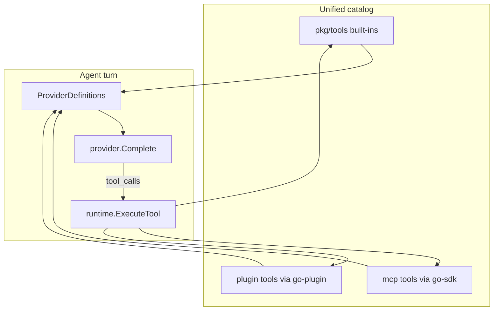

Curated dependency shortlist for Elph. **Minimal TUI** — no fancy CLI/TUI polish; Charm indirect deps (chroma, uniseg, colorprofile, …) ride along with bubbletea/lipglamour and are not listed here.

| Status    | Meaning                                  |
|-----------|------------------------------------------|
| **used**  | In `go.mod` today                        |
| **next**  | Planned for tools, plugins, or providers |
| **later** | Defer until a concrete need              |
| **ref**   | Read code only; do not import            |
| **drop**  | Removed from scope — do not add          |

See: [Tools](/guides/tools/), [Architecture](/guides/architecture/).

---

## SDK

| Package                                                                       | Status   | Use                                   |
|-------------------------------------------------------------------------------|----------|---------------------------------------|
| [anthropics/anthropic-sdk-go](https://github.com/anthropics/anthropic-sdk-go) | **used** | Anthropic adapter                     |
| [openai/openai-go](https://github.com/openai/openai-go)                       | **used** | OpenAI / compat / OpenRouter adapters |
| [google.golang.org/genai](https://google.golang.org/genai)                    | **next** | Gemini — stub in `providers/google`   |

---

## Agent / providers

| Package                                          | Status    | Use                                                                    |
|--------------------------------------------------|-----------|------------------------------------------------------------------------|
| [charm.land/fantasy](https://charm.land/fantasy) | **ref**   | Provider + tool-loop patterns (Elph has own `protocol` / `providers/`) |
| [charm.land/x/vcr](https://charm.land/x/vcr)     | **next**  | HTTP record/replay for `providertests`                                 |
| [charm.land/catwalk](https://charm.land/catwalk) | **later** | Optional model catalog; models.dev already covers sync                 |

---

## Built-in tools

Today **Read**, **Write**, **Edit**, **Grep**, **Glob**, **ReadMediaFile**, **Bash**, and **AskUser** run end-to-end
(Write/Edit/Bash via huh approval; AskUser via question UI). User vision paste uses
`golang.design/x/clipboard` in the TUI. Rest of catalog in `pkg/tools` awaits handlers + (for some) approval UI.

| Package                                                                                   | Status    | Tool / area                                               |
|-------------------------------------------------------------------------------------------|-----------|-----------------------------------------------------------|
| [bmatcuk/doublestar/v4](https://github.com/bmatcuk/doublestar)                            | **used**  | **Glob** — `**` semantics (`internal/runtime/execute.go`) |
| [mvdan/sh](https://github.com/mvdan/sh)                                                   | **used**  | **Bash** — syntax validation before `bash -c`             |
| [PuerkitoBio/goquery](https://github.com/PuerkitoBio/goquery)                             | **next**  | **FetchURL** — HTML DOM                                   |
| [JohannesKaufmann/html-to-markdown](https://github.com/JohannesKaufmann/html-to-markdown) | **next**  | **FetchURL** — HTML → markdown                            |
| [microcosm-cc/bluemonday](https://github.com/microcosm-cc/bluemonday)                     | **next**  | **FetchURL** — sanitize HTML                              |
| [golang.org/x/net](https://golang.org/x/net)                                              | **next**  | **FetchURL**, **WebSearch**, **CodeSearch**               |
| [gabriel-vasile/mimetype](https://github.com/gabriel-vasile/mimetype)                     | **next**  | **ReadMediaFile** — sniff type                            |
| `image` + [golang.org/x/image](https://pkg.go.dev/golang.org/x/image)                     | **used**  | **ReadMediaFile** + clipboard paste — decode/resize/webp  |
| [golang.design/x/clipboard](https://golang.design/x/clipboard)                            | **used**  | Image paste in TUI (`internal/clipboardmedia`)            |
| [aymanbagabas/go-udiff](https://github.com/aymanbagabas/go-udiff)                         | **later** | **Edit** approval preview (functional, not TUI chrome)    |
| [invopop/jsonschema](https://github.com/invopop/jsonschema)                               | **later** | Optional schema gen from structs (hand-written today)     |

**Optional** — add only when a specific tool needs them: [itchyny/gojq](https://github.com/itchyny/gojq), [tidwall/gjson](https://github.com/tidwall/gjson), [charlievieth/fastwalk](https://github.com/charlievieth/fastwalk) (if Glob is hot on huge trees; else `WalkDir` + doublestar).

---

## Extension model: MCP + Go plugins (combined)

**Both ship in Elph.** Different purpose, same host pipeline — not either/or.

|                      | **MCP**                                                                       | **Go plugins**                                                |
|----------------------|-------------------------------------------------------------------------------|---------------------------------------------------------------|
| **Package**          | [modelcontextprotocol/go-sdk](https://github.com/modelcontextprotocol/go-sdk) | [hashicorp/go-plugin](https://github.com/hashicorp/go-plugin) |
| **Purpose**          | Connect to **ecosystem tool servers** (stdio/SSE/HTTP)                        | Ship **first-party / private** extensions as local binaries   |
| **Who writes tools** | Community servers (Figma, Postgres, …)                                        | Elph users or your team in Go                                 |
| **Config**           | `schemas/mcp-schema.json` → `~/.elph/mcp/`                                    | `~/.elph/plugins/` + plugin manifest                          |
| **Wire protocol**    | MCP JSON-RPC                                                                  | gRPC over go-plugin subprocess                                |
| **Tool prefix**      | `mcp_<server>_<tool>`                                                         | `plugin_<id>_<tool>`                                          |
| **Status**           | **next**                                                                      | **next**                                                      |

Shared host responsibilities (one code path):

1. **Discover** — merge tool definitions from built-ins + MCP sessions + loaded plugins.
2. **Expose** — same `IsProviderExposed` / approval rules per tool (see [Tools](/guides/tools/)).
3. **Execute** — `runtime.ExecuteTool` dispatches by prefix → builtin handler, MCP client, or plugin RPC.
4. **Prompt** — `prompt.ExternalEntry` lists MCP and plugin tools for the system prompt.

### Go plugin stack (recommended)

| Package                                                       | Status   | Role                                                          |
|---------------------------------------------------------------|----------|---------------------------------------------------------------|
| [hashicorp/go-plugin](https://github.com/hashicorp/go-plugin) | **next** | Host ↔ plugin subprocess; handshake, lifecycle, gRPC broker   |
| `google.golang.org/grpc`                                      | **next** | Transport (pulled by go-plugin)                               |
| `google.golang.org/protobuf`                                  | **next** | Shared tool contract `.proto` in `pkg/pluginapi/` (to define) |

**Design sketch**

- Core defines a small **plugin API** (list tools, execute, optional events) — stable protobuf, versioned.
- Plugins are **separate binaries** under `~/.elph/plugins/` (or path in settings).
- Host spawns plugin on demand or at session start; `go-plugin` handles reattach and stderr logging.
- Tool names exposed to model as `plugin_<id>_<tool>` (same pattern as future `mcp_*`).
- Approval policy inherits from plugin manifest (like built-in `DefaultApproval`).

### Alternatives for local extensions (instead of go-plugin)

Use when requirements differ; MCP remains unchanged.

| Package                                                     | Status    | Fits when                                                                                                                | Tradeoff                                                                                                          |
|-------------------------------------------------------------|-----------|--------------------------------------------------------------------------------------------------------------------------|-------------------------------------------------------------------------------------------------------------------|
| [tetratelabs/wazero](https://github.com/tetratelabs/wazero) | **later** | Sandboxed **WASM** plugins (`.wasm` in `~/.elph/plugins/`); multi-language guests; pure Go runtime, no CGO               | Need a WASM↔host ABI (custom or via Extism); slower cold start than native binary; prefix e.g. `wasm_<id>_<tool>` |
| [extism/go-sdk](https://github.com/extism/go-sdk)           | **later** | Same as wazero but with **ready-made** plugin manifest, WASI, and host fn bindings — typically **wazero under the hood** | Extra layer vs raw wazero; smaller ecosystem than go-plugin                                                       |
| [traefik/yaegi](https://github.com/traefik/yaegi)           | **later** | Quick in-process Go scripts — no compile step                                                                            | **No isolation** — guest panic kills the agent                                                                    |
| `plugin` (stdlib)                                           | **drop**  | —                                                                                                                        | Linux-centric, fragile ABI across Go versions                                                                     |

**Recommendation:** ship **go-sdk (MCP)** + **go-plugin (native Go)** first. Add **wazero** (alone or via extism) when sandboxed or non-Go local plugins are required — it does not replace MCP or go-plugin; it is a third local extension backend.

---

## TUI core (minimal — no polish layer)

Direct dependencies only. Do not add styling/logging/editor helpers beyond this.

| Package                                                                   | Status   | Use                                                  |
|---------------------------------------------------------------------------|----------|------------------------------------------------------|
| [charm.land/bubbletea](https://charm.land/bubbletea)                      | **used** | Event loop                                           |
| [charm.land/bubbles](https://charm.land/bubbles)                          | **used** | Viewport, input, lists                               |
| [charm.land/lipgloss](https://charm.land/lipgloss)                        | **used** | Theme (`internal/theme`)                             |
| [charm.land/glamour](https://charm.land/glamour) v2                       | **used** | Assistant markdown (tables, blockquotes, preprocess) |
| [charm.land/huh](https://charm.land/huh)                                  | **used** | Confirm dialogs (models.dev sync)                    |
| [charmbracelet/x/ansi](https://github.com/charmbracelet/x/ansi)           | **used** | Keys / ANSI                                          |
| [charmbracelet/x/term](https://github.com/charmbracelet/x/term)           | **used** | Terminal size                                        |
| [charmbracelet/ultraviolet](https://github.com/charmbracelet/ultraviolet) | **used** | Input tests only                                     |
| [mattn/go-runewidth](https://github.com/mattn/go-runewidth)               | **used** | Column width                                         |
| [atotto/clipboard](https://github.com/atotto/clipboard)                   | **used** | Copy text (work dir, session id, last message)       |
| [golang.design/x/clipboard](https://golang.design/x/clipboard)            | **used** | Paste image (and text fallback) in input             |

---

## Runtime / CLI / data

| Package                                                     | Status    | Use                                         |
|-------------------------------------------------------------|-----------|---------------------------------------------|
| [spf13/cobra](https://github.com/spf13/cobra)               | **used**  | CLI                                         |
| [subosito/gotenv](https://github.com/subosito/gotenv)       | **used**  | `--env-file`                                |
| [go-git/go-git/v5](https://github.com/go-git/go-git/v5)     | **used**  | Git footer                                  |
| [sergi/go-diff](https://github.com/sergi/go-diff)           | **used**  | Line stats diffs                            |
| [go.jetify.com/typeid/v2](https://go.jetify.com/typeid/v2)  | **used**  | Session IDs                                 |
| [gopkg.in/yaml.v3](https://gopkg.in/yaml.v3)                | **used**  | Prompt template frontmatter                 |
| `pkg/core/fuzzy`                                            | **used**  | Model/provider match (in-tree)              |
| [dustin/go-humanize](https://github.com/dustin/go-humanize) | **later** | Byte/duration labels in tool output         |
| [ncruces/go-sqlite3](https://github.com/ncruces/go-sqlite3) | **later** | Plugin registry, session history, audit log |
| [pressly/goose](https://github.com/pressly/goose)           | **later** | SQLite migrations (with sqlite3)            |
| [stretchr/testify](https://github.com/stretchr/testify)     | **used**  | Tests                                       |
| [go.uber.org/goleak](https://go.uber.org/goleak)            | **later** | Leak checks in agent loop tests             |
| [golang.org/x/sync](https://golang.org/x/sync)              | **later** | Parallel tool calls (`errgroup`)            |

Open URLs: `open` / `xdg-open` exec — no `pkg/browser`.

---

## Dropped (out of scope for minimal Elph)

Do not add these unless requirements change.

| Package                                                                   | Reason                                                |
|---------------------------------------------------------------------------|-------------------------------------------------------|
| charm.land/fang, MakeNowJust/heredoc                                      | Fancy CLI help — Cobra defaults are enough            |
| charm.land/log                                                            | Charm-styled logging — session file logs suffice      |
| charmbracelet/x/editor, x/etag, x/powernap, x/exp/charmtone, x/exp/golden | TUI/HTTP polish                                       |
| jordanella/go-ansi-paintbrush                                             | ANSI art banners                                      |
| gen2brain/beeep, esiqveland/notify                                        | Desktop notifications                                 |
| swaggo/swag, swaggo/http-swagger                                          | No HTTP API planned                                   |
| denisbrodbeck/machineid                                                   | Stale; no telemetry planned                           |
| pkg/browser, joho/godotenv                                                | Replaced by exec / gotenv                             |
| nxadm/tail, natefinch/lumberjack                                          | Stale; fsnotify or simple rotate in-house             |
| disintegration/imaging, go-shiori/go-readability                          | Stale/archived                                        |
| sourcegraph/jsonrpc2                                                      | Use MCP SDK only                                      |
| sahilm/fuzzy                                                              | In-tree fuzzy exists                                  |
| aymanbagabas/go-nativeclipboard                                           | Replaced by golang.design/x/clipboard for image paste |

---

## Maintenance quick reference

| Avoid                        | Use instead                             |
|------------------------------|-----------------------------------------|
| disintegration/imaging       | stdlib `image` + `x/image` + mimetype   |
| atotto/clipboard (copy only) | golang.design/x/clipboard (paste done)  |
| go-shiori/go-readability     | goquery + html-to-markdown + bluemonday |

---

## Suggested build order

1. **Tools** — FetchURL (+ bluemonday); go-udiff for Edit approval preview when needed.
2. **Extension host** — unified catalog + `ExecuteTool` dispatch (prefix routing).
3. **Go plugins** — protobuf `pkg/pluginapi` + **go-plugin** loader.
4. **MCP** — **go-sdk** client in parallel; same merge/expose path as plugins.
5. **Providers** — Google genai; VCR tests.
6. **Persistence** — sqlite + goose for MCP/plugin registry (if needed).
